# 💧 Smart IoT Water Level Monitoring System

[](https://www.espressif.com/en/products/socs/esp32)
[](https://www.arduino.cc)
[](https://blynk.io)
[](https://en.wikipedia.org/wiki/Internet_of_things)

> An ESP32-based IoT water level monitoring system featuring ultrasonic distance measurement, OLED display, and real-time cloud monitoring via Blynk platform. Built for reliable water tank level monitoring with remote accessibility.

## 🚀 Features

- ✅ **Ultrasonic Distance Measurement** - Accurate water level detection using HC-SR04
- ✅ **Real-time Display** - Local OLED screen showing live measurements
- ✅ **IoT Cloud Integration** - Remote monitoring via Blynk platform
- ✅ **WiFi Connectivity** - Wireless data transmission and remote access
- ✅ **Continuous Monitoring** - 24/7 water level tracking
- ✅ **Mobile App Control** - Monitor from anywhere using Blynk mobile app
- ✅ **Serial Debug Output** - Development and troubleshooting support
- ✅ **Dual Unit Display** - Measurements in both centimeters and inches

## 🌟 Overview

This IoT water level monitoring system provides real-time measurement and remote monitoring capabilities for water tanks, reservoirs, or any liquid containers. The system uses an ultrasonic sensor for non-contact distance measurement, displays readings on a local OLED screen, and transmits data to the cloud for remote monitoring via smartphone or web interface.

## 🏗️ System Architecture

```mermaid
graph TB
    subgraph "Hardware Layer"
        A[🔧 ESP32 Controller] --> B[📡 HC-SR04 Ultrasonic]
        A --> C[📺 OLED Display]
        A --> D[📶 WiFi Module]
    end
    
    subgraph "Communication Layer"
        D --> E[🌐 Internet]
        E --> F[☁️ Blynk Cloud]
    end
    
    subgraph "User Interface"
        C --> G[📱 Local Display]
        F --> H[📱 Mobile App]
        F --> I[💻 Web Dashboard]
    end
    
    subgraph "Data Flow"
        B --> J[📏 Distance Measurement]
        J --> K[🔄 Data Processing]
        K --> L[📊 Display & Transmit]
    end
```



## 📂 Project Structure

```
WaterLevelMonitor/
├── REVIEW2.ino          # Main Arduino sketch
├── README.md            # Project documentation
├── libraries/           # Required libraries
│   ├── BlynkSimpleEsp32/
│   ├── Adafruit_GFX/
│   └── Adafruit_SSD1306/
└── docs/
    ├── wiring_diagram.png
    └── setup_guide.md
```

## 🔧 Hardware Components

### Required Components

| Component | Quantity | Purpose |
|-----------|----------|---------|
| ESP32 Development Board | 1 | Main microcontroller |
| HC-SR04 Ultrasonic Sensor | 1 | Distance measurement |
| SSD1306 OLED Display (128x64) | 1 | Local data display |
| Jumper Wires | 10+ | Connections |
| Breadboard | 1 | Prototyping |
| Power Supply (5V/3.3V) | 1 | System power |

### Pin Configuration

```cpp
// Ultrasonic Sensor Pins
const int trigPin = 5;      // Trigger pin
const int echoPin = 18;     // Echo pin

// OLED Display
// SDA: GPIO 21 (default I2C)
// SCL: GPIO 22 (default I2C)
// Address: 0x3C
```

## ⚙️ Software Configuration

### Blynk Platform Setup

```cpp
#define BLYNK_TEMPLATE_ID "TMPL3BFN2oENm"
#define BLYNK_TEMPLATE_NAME "ESP32 WaterLevel"
#define BLYNK_AUTH_TOKEN "7w4fj76RmqQgt6OsMU0hlFvS5mu1ykih"
```

### WiFi Configuration

```cpp
const char* ssid = "Bread";                    // WiFi network name
const char* password = "<<your password>>";           // WiFi password
char auth[] = "<<Your Blynk authentication token>>";  // Blynk auth token
```

### Virtual Pin Mapping

```cpp
#define VPIN_BUTTON_1 V1  // Virtual pin for water level data
```

## 📊 Measurement System

### Distance Calculation

The system uses the time-of-flight principle for distance measurement:

```cpp
// Sound speed in air at room temperature
#define SOUND_SPEED 0.034  // cm/μs
#define CM_TO_INCH 0.393701

// Distance calculation
distanceCm = duration * SOUND_SPEED / 2;
distanceInch = distanceCm * CM_TO_INCH;
```

### Measurement Process

1. **Trigger Pulse**: Send 10μs HIGH pulse to trigger pin
2. **Echo Detection**: Measure echo pulse duration
3. **Distance Calculation**: Convert time to distance using sound speed
4. **Unit Conversion**: Calculate both cm and inch values
5. **Data Transmission**: Send to display and cloud

## 🔍 Core Functionality

### Main Loop Operations

```cpp
void loop() {
    Blynk.run();                    // Handle Blynk communication
    
    // Ultrasonic measurement sequence
    digitalWrite(trigPin, LOW);
    delayMicroseconds(2);
    digitalWrite(trigPin, HIGH);
    delayMicroseconds(10);
    digitalWrite(trigPin, LOW);
    
    // Calculate distance
    duration = pulseIn(echoPin, HIGH);
    distanceCm = duration * SOUND_SPEED / 2;
    
    // Update displays
    updateOLED();
    updateBlynk();
    
    delay(500);  // 2Hz update rate
}
```

### Display Management

```cpp
// OLED Display Update
display.clearDisplay();
display.setCursor(0, 25);
display.print(distanceCm);
display.print(" cm");
display.display();
```

### Cloud Data Transmission

```cpp
// Send data to Blynk cloud
Blynk.virtualWrite(VPIN_BUTTON_1, distanceCm);
```

## 💻 Setup and Installation

### Prerequisites

- Arduino IDE 1.8.0 or higher
- ESP32 Board Package
- Required libraries (see below)
- Blynk account and app

### Required Libraries

Install these libraries through Arduino IDE Library Manager:

```cpp
#include <BlynkSimpleEsp32.h>   // Blynk ESP32 library
#include <Wire.h>               // I2C communication
#include <Adafruit_GFX.h>       // Graphics library
#include <Adafruit_SSD1306.h>   // OLED display driver
#include <WiFiClient.h>         // WiFi client
#include <WiFi.h>               // WiFi library
```

### Installation Steps

1. **Install Arduino IDE**
```bash
# Download from https://www.arduino.cc/en/software
```

2. **Add ESP32 Board Support**
```
File → Preferences → Additional Board Manager URLs:
https://dl.espressif.com/dl/package_esp32_index.json
```

3. **Install Required Libraries**
```
Tools → Manage Libraries → Search and install:
- Blynk by Volodymyr Shymanskyy
- Adafruit GFX Library
- Adafruit SSD1306
```

4. **Setup Blynk Account**
```
1. Download Blynk app
2. Create new project
3. Get Auth Token
4. Add Gauge widget on V1
```

5. **Configure and Upload**
```cpp
// Update these in the code:
- WiFi credentials
- Blynk Auth Token
- Pin assignments (if different)
```

## 🔧 Hardware Wiring

### Connection Diagram

```
ESP32          HC-SR04
-----          -------
GPIO 5    →    Trig
GPIO 18   →    Echo
3.3V      →    VCC
GND       →    GND

ESP32          OLED Display
-----          ------------
GPIO 21   →    SDA
GPIO 22   →    SCL
3.3V      →    VCC
GND       →    GND
```

### Wiring Safety

- Double-check all connections before powering up
- Use appropriate voltage levels (3.3V for ESP32)
- Ensure proper grounding
- Use quality jumper wires for reliable connections

## 📱 Mobile App Configuration

### Blynk App Setup

1. **Create New Project**
   - Choose ESP32 as device
   - Select WiFi connection
   - Note the Auth Token

2. **Add Widgets**
   - Gauge widget on Virtual Pin V1
   - Set min/max values (0-400 cm typical)
   - Configure update frequency

3. **Widget Configuration**
   - Label: "Water Level"
   - Units: "cm"
   - Color: Blue theme
   - Reading rate: 1 second

## 🔍 Monitoring and Alerts

### Data Visualization

- **Real-time Graph**: Historical water level trends
- **Current Reading**: Live distance measurement
- **Status Indicators**: Connection and sensor status
- **Threshold Alerts**: Low/high water level notifications

### Alert Configuration

```cpp
// Example alert implementation
if (distanceCm < 10) {
    Blynk.notify("Water level critically low!");
}
if (distanceCm > 300) {
    Blynk.notify("Sensor may be disconnected!");
}
```

## ⚡ Customization Options

### Adjust Update Frequency

```cpp
delay(1000);  // Change from 500ms to 1000ms for 1Hz updates
```

### Modify Display Format

```cpp
display.setTextSize(1);  // Smaller text
display.printf("Level: %d cm\nStatus: OK", distanceCm);
```

### Add Multiple Sensors

```cpp
#define VPIN_TANK1 V1
#define VPIN_TANK2 V2
// Add additional trigger/echo pins
```

### Calibration Settings

```cpp
// Calibrate for specific tank dimensions
int waterLevel = tankHeight - distanceCm;
int waterPercentage = (waterLevel * 100) / tankHeight;
```

## 🧪 Testing and Troubleshooting

### Serial Monitor Debug

```cpp
Serial.print("Distance (cm): ");
Serial.println(distanceCm);
Serial.print("WiFi Status: ");
Serial.println(WiFi.status());
```

### Common Issues

| Issue | Cause | Solution |
|-------|--------|----------|
| No WiFi connection | Wrong credentials | Check SSID/password |
| Blynk not connecting | Auth token error | Verify token in app |
| Erratic readings | Loose connections | Check wiring |
| Display not working | I2C address wrong | Try 0x3D address |

### Diagnostic Tests

```cpp
// Test ultrasonic sensor
void testSensor() {
    for(int i = 0; i < 10; i++) {
        // Take 10 readings
        Serial.println(measureDistance());
        delay(100);
    }
}
```

## 📊 Technical Specifications

### Performance Metrics

- **Measurement Range**: 2cm - 400cm
- **Accuracy**: ±3mm
- **Update Rate**: 2Hz (configurable)
- **WiFi Range**: 100m (open space)
- **Power Consumption**: ~240mA (active)
- **Operating Temperature**: -10°C to +70°C

### System Limits

- **Maximum Distance**: 400cm (HC-SR04 limit)
- **Minimum Distance**: 2cm (blind zone)
- **WiFi Timeout**: 10 seconds
- **Blynk Connection**: Auto-reconnect enabled

## 🔒 Security Considerations

### Network Security

- Use WPA2/WPA3 encrypted WiFi
- Change default Blynk Auth Token
- Implement device authentication
- Regular firmware updates

### Data Privacy

- Blynk data encryption in transit
- Local data processing
- No sensitive information stored
- User-controlled data retention

## 🌐 Applications

### Use Cases

- **Residential**: Home water tank monitoring
- **Industrial**: Process tank level control
- **Agricultural**: Irrigation system management
- **Environmental**: Flood/drought monitoring
- **Commercial**: Building water management

### Integration Possibilities

- Home automation systems
- SCADA integration
- SMS/Email notifications
- Database logging
- IoT platforms (ThingSpeak, AWS IoT)

## 📝 Advanced Features

### Potential Enhancements

```cpp
// Time-based averaging
float getAverageDistance(int samples) {
    float total = 0;
    for(int i = 0; i < samples; i++) {
        total += measureDistance();
        delay(50);
    }
    return total / samples;
}

// Temperature compensation
float compensateForTemperature(float distance, float temp) {
    float speedAtTemp = 331.4 + (0.6 * temp);
    return distance * (speedAtTemp / 343.0);
}
```
---

**Note**: This is a basic IoT water level monitoring system. For industrial applications, consider adding redundancy, professional-grade sensors, and certified components for safety-critical environments.
